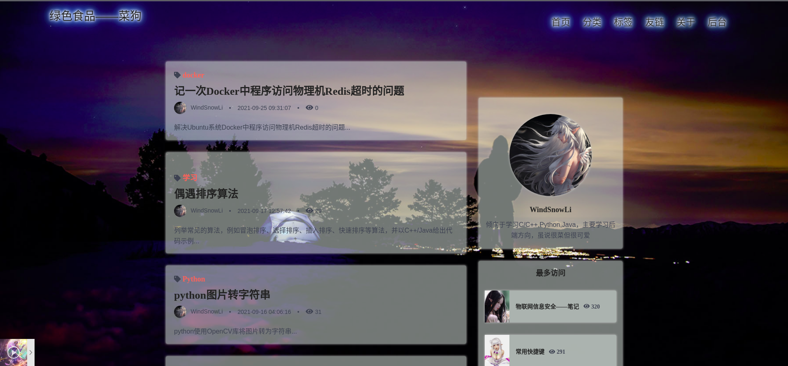
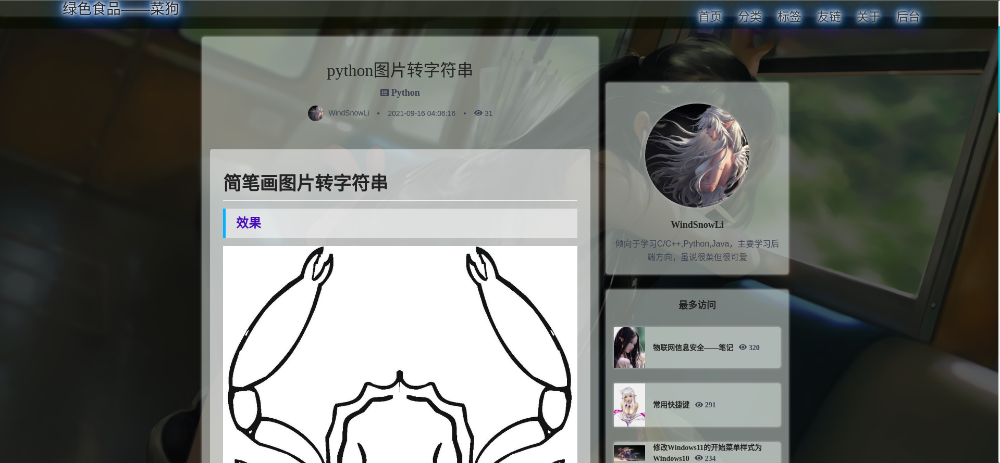
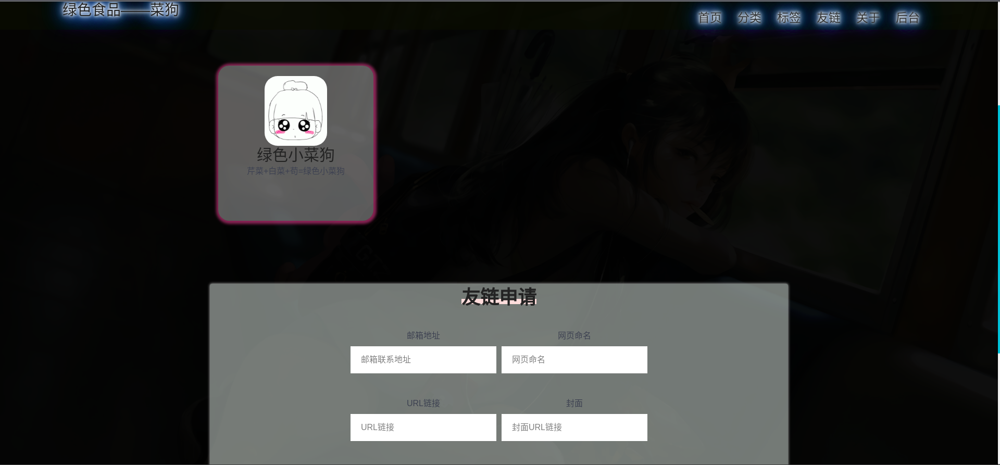
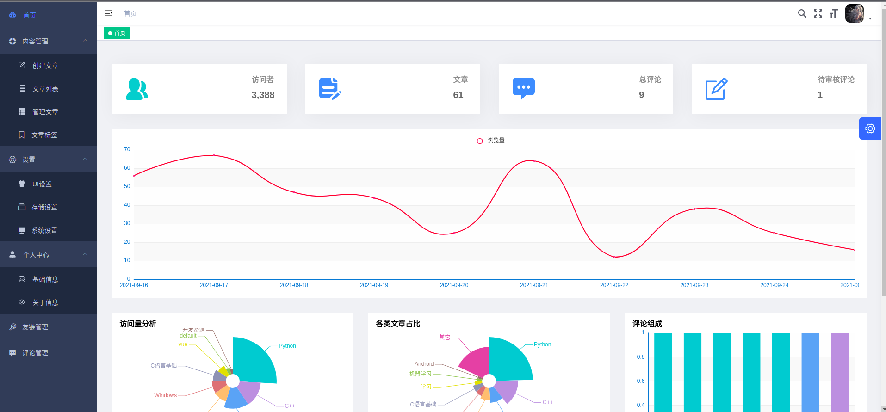
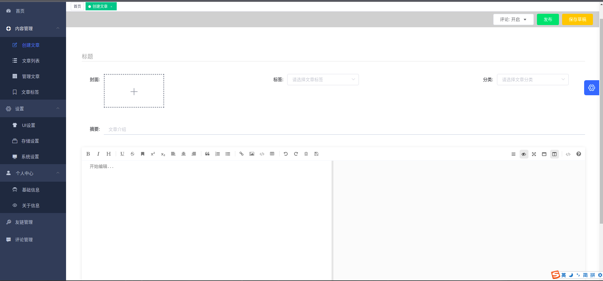
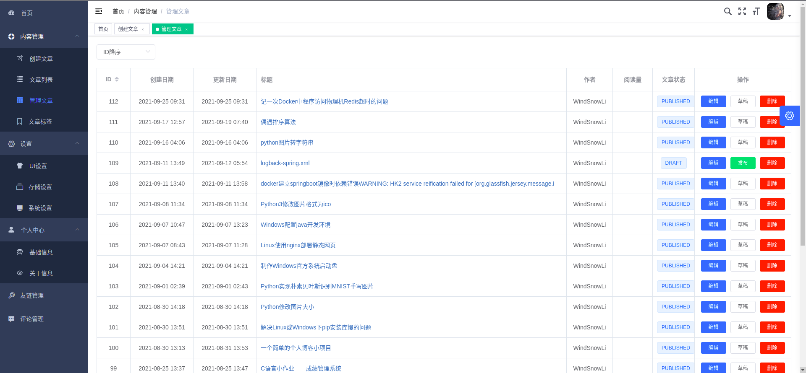
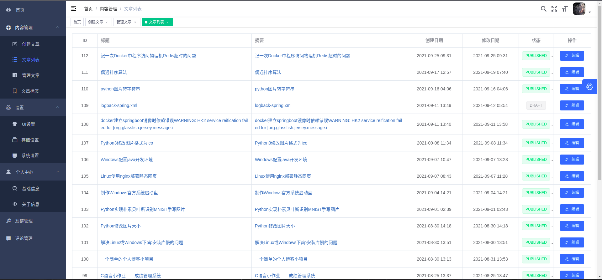
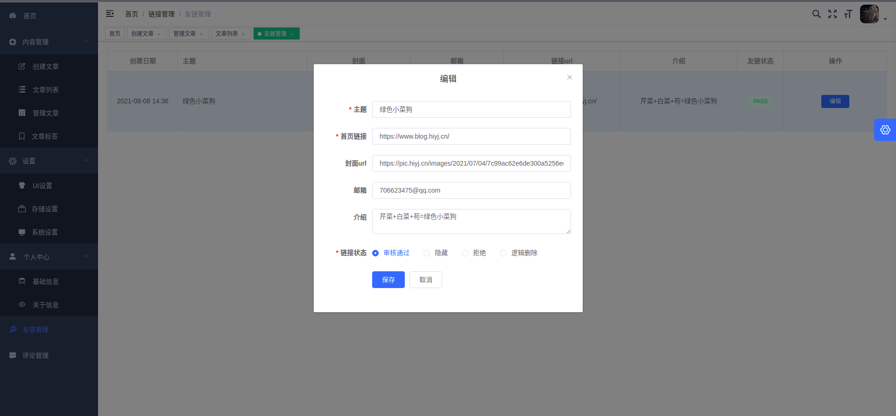

# w-blog

## 描述

一个后端使用Spring Boot 2.x、前台使用nuxtJs、后台使用vue的个人博客

## 简介

1. 链接
    - Gitee链接：
        - [api](https://gitee.com/windsnowli/w-blog-api)： `https://gitee.com/windsnowli/w-blog-api`
        - [前台](https://gitee.com/windsnowli/vue-ssr-blog)： `https://gitee.com/windsnowli/vue-ssr-blog`
        - [后台](https://gitee.com/windsnowli/vue-admin-blog)： `https://gitee.com/windsnowli/vue-admin-blog`
    - GitHub链接：
        - [api](https://github.com/WindSnowLi/w-blog-api)： `https://github.com/WindSnowLi/w-blog-api`
        - [前台](https://github.com/WindSnowLi/vue-ssr-blog)： `https://github.com/WindSnowLi/vue-ssr-blog`
        - [后台](https://github.com/WindSnowLi/vue-admin-blog)： `https://github.com/WindSnowLi/vue-admin-blog`

2. 一个简单的的个人博客项目，共分为了 `前台`、 `后台`、 `api`三个部分。

    - api: 后端基于 `SpringBoot` 。主要依赖 `Mybatis` 、 `Mybatis-Redis` 、 `Redis` 、 `fastjson` 、 `DruidDataSource` 、 `Lombok`
      、 `java-jwt` 、 `aliyun-sdk-oss` 、 `knife4j` 等，数据库使用的是 `MySQL8.0+`

    - 前台: 前台的主要样式是来源于网络上了一个 `BizBlog` 模板，最初来源于哪我不得而知，在原本的基础上改写成了 `nuxtJs` 项目。
    - 后台: 后台UI套用的[vue-element-admin](https://github.com/PanJiaChen/vue-element-admin)，基本是直接拿来用了，想自己定制着实实力不允许。

3. 示例：[绿色食品——菜狗](https://www.blog.hiyj.cn/)

## 本地启动

### 逐个项目启动

#### api：前台后台请求的api使用的是同一个项目

1. `git clone https://gitee.com/WindSnowLi/w-blog-api.git`或`git clone https://github.com/WindSnowLi/w-blog-api.git`
   克隆项目到本地
2. `mvn clean install dependency:tree` 安装依赖
3. 创建数据库，并设置为`UTF8`编码（`utf8mb4`）
4. 修改环境设置
    - 修改开发环境 `application-dev.yml` 和生产环境 `application-prod.yml` 中的数据库配置信息；
    - 修改 `redis.properties` 中的 `Redis` 相关信息；
    - 注： `knife4j` 只在开发环境中激活。

5. `mvn clean package -Dmaven.test.skip=true` 跳过测试并生成 `jar` 包
6. `java -jar 生成的包名.jar` 运行开发配置环境，初次运行会自动初始化数据库（生产环境可指定加载的配置文件`--spring.profiles.active="prod"`）
7. 访问 `http://127.0.0.1:9000/doc.html` 查看 `api` 文档
8. *推荐使用IDEA打开项目文件夹自动处理依赖、方便运行*

#### 前台

1. `git clone https://gitee.com/WindSnowLi/vue-ssr-blog.git`或`git clone https://github.com/WindSnowLi/vue-ssr-blog.git`
   克隆项目到本地
2. `npm install` 安装依赖
3. 可修改 `config/sitemap.xml` 文件中的 `host` 地址，用于生成访问地图
4. 可修改 `nuxt.config.js` 中的端口号
5. 可修改 `package.json` 文件中的 `script` 中的 `BASE_URL` 来指定后端 `api` 地址
6. `npm run build` 编译
7. `npm start` 本地运行

#### 后台

1. `git clone https://gitee.com/WindSnowLi/vue-admin-blog.git`或`git clone https://github.com/WindSnowLi/vue-admin-blog.git`
   克隆项目到本地
2. `npm install` 安装依赖
3. `npm run dev` 使用模拟数据预览界面
4. 修改 `.env.production` 文件中的 `VUE_APP_BASE_API` 地址为后端 `api` 的地址
5. `npm run build:prod` 编译
6. `dist` 文件夹下的为编译好的文件，可放到 `http` 服务器下（可以使用 `npm` 安装 `http-server` ）进行访问

### Docker集成启动

1. `git clone https://gitee.com/WindSnowLi/w-blog.git`或`git clone https://github.com/WindSnowLi/w-blog.git`克隆`w-blog`仓库至本地
2. `cd w-blog`切换进`w-blog`根目录
3. `sh ./step-1-clone.sh`克隆`w-blog-api`、`vue-ssr-blog`、`vue-admin-blog`仓库至根目录
4. 修改各项目相关配置
    1. `w-blog-api`项目
        1. 修改开发环境 `application-dev.yml` 和生产环境 `application-prod.yml` 中的数据库配置信息；
        2. 修改 `redis.properties` 中的 `Redis` 相关信息；
        3. 注： `knife4j` 只在开发环境中激活。
        4. `redis可自行安装`，也可`docker-compose.yml`指定相关设置
    2. `vue-ssr-blog`项目
        1. 可修改 `config/sitemap.xml` 文件中的 `host` 地址，用于生成访问地图
        2. 可修改 `nuxt.config.js` 中的端口号
        3. 可修改 `package.json` 文件中的 `script` 中的 `BASE_URL` 来指定后端 `api` 地址
    3. `vue-admin-blog`项目
        1. 修改 `.env.production` 文件中的 `VUE_APP_BASE_API` 地址为后端 `api` 的地址
5. `sh ./step-2-build.sh`安装依赖生成相关文件
6. 修改`docker-compose.yml`的相关端口映射和文件夹映射
7. `docker-compose up -d`生成`docker镜像`并运行

## 界面展示

### 前台

 

 

### 后台

 

 

 

 

## License

[MIT](https://github.com/WindSnowLi/w-blog/blob/master/LICENSE)

Copyright (c) 2021 WindSnowLi
